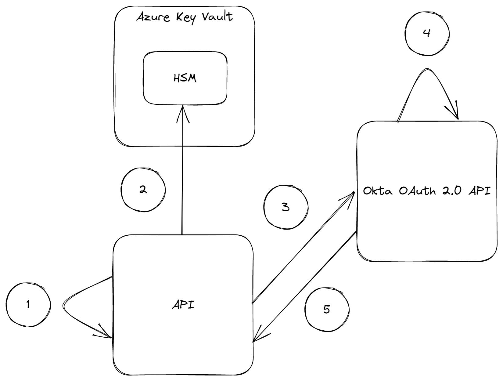

  <h1 align="center">🔒🔑 okta-key-vault-client-assertion</h1>

## Description

This project demonstrates the use of Azure Key Vault to sign client assertions for retrieveing access tokens from Okta via the client credentials flow.

## Overview

  </img>

1. Generate unsigned client assertion (JWT)
2. Send unsigned client assertion to Azure Key Vault for signing operation
3. Send signed client assertion to the `token` endpoint
4. Verify the client assertion with a public key
5. Return access token